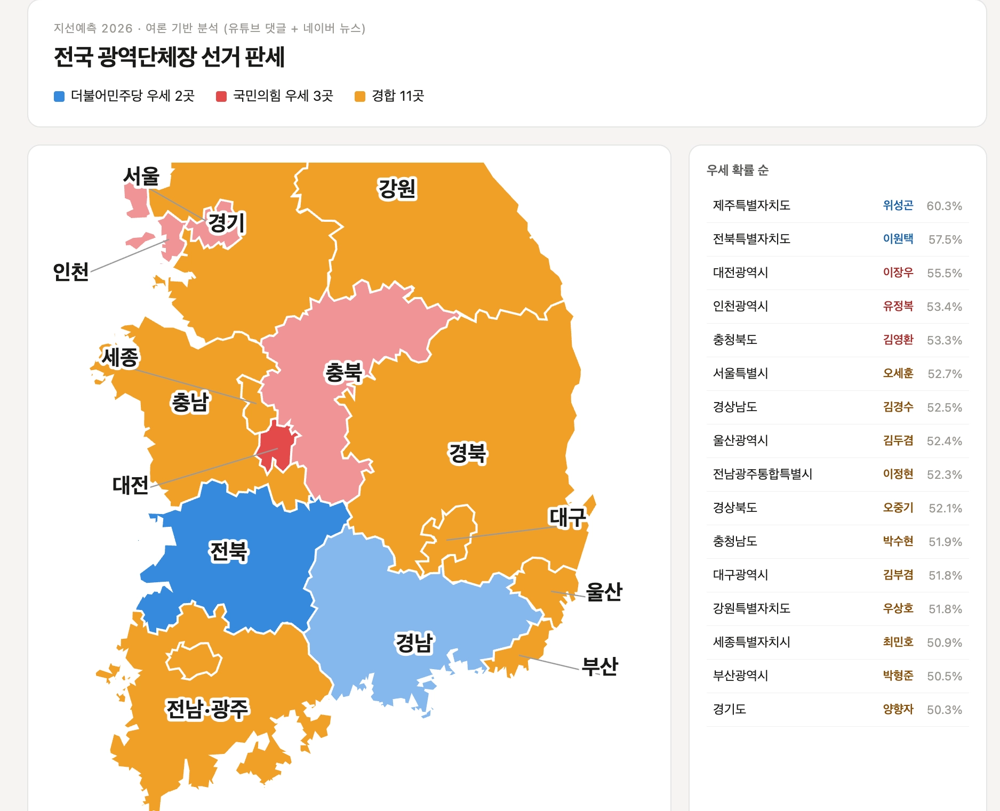
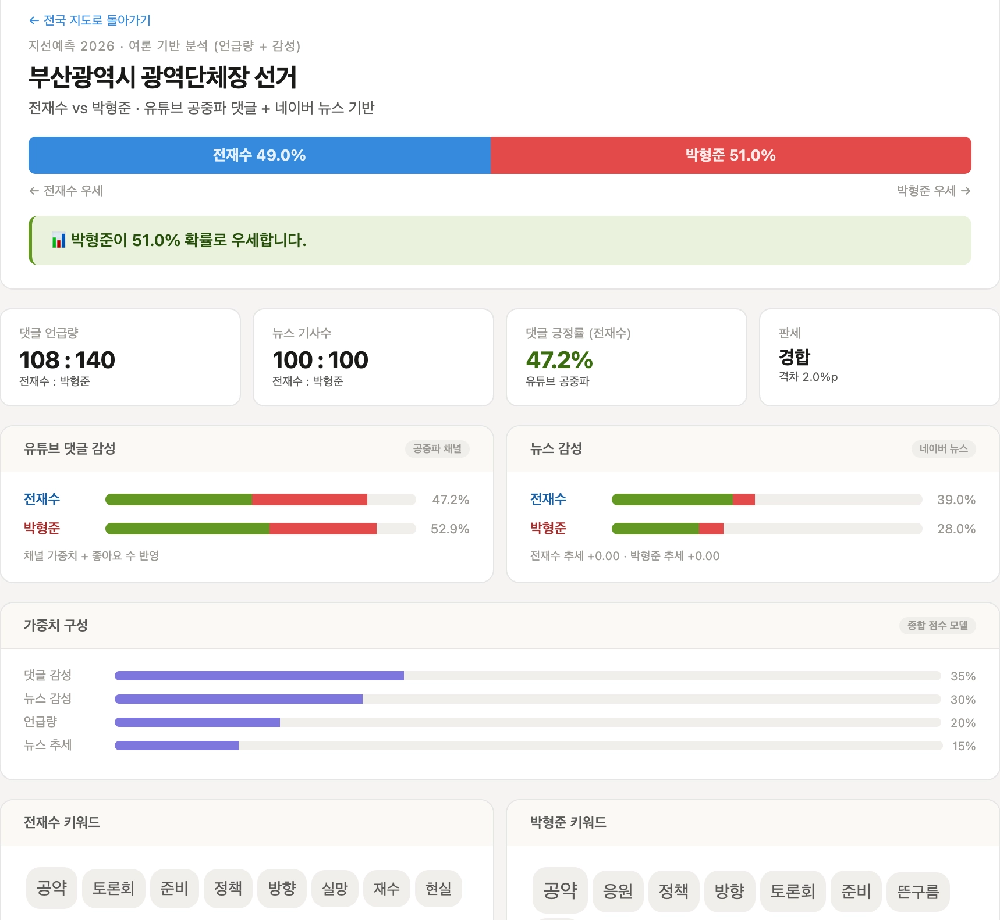
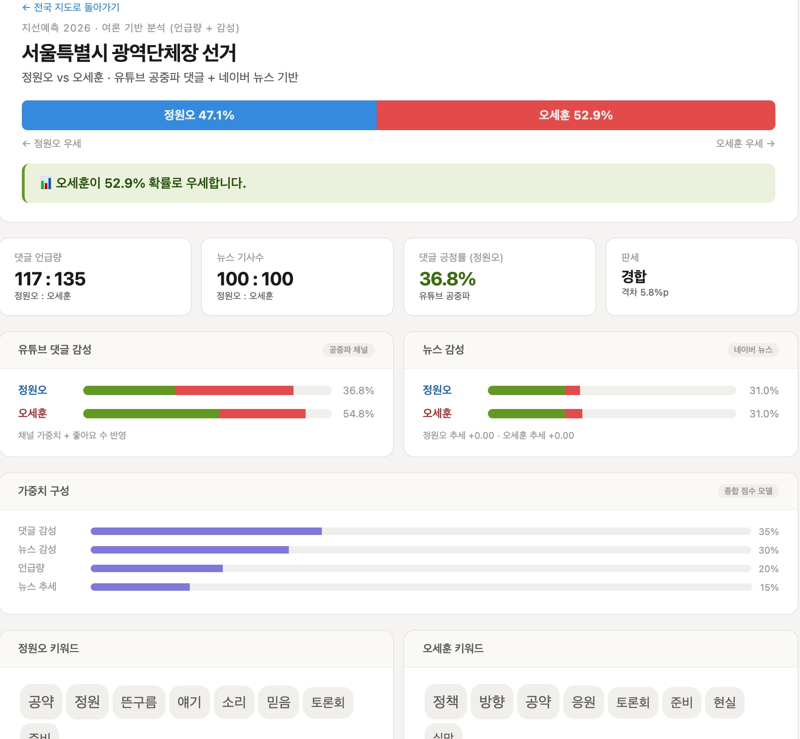
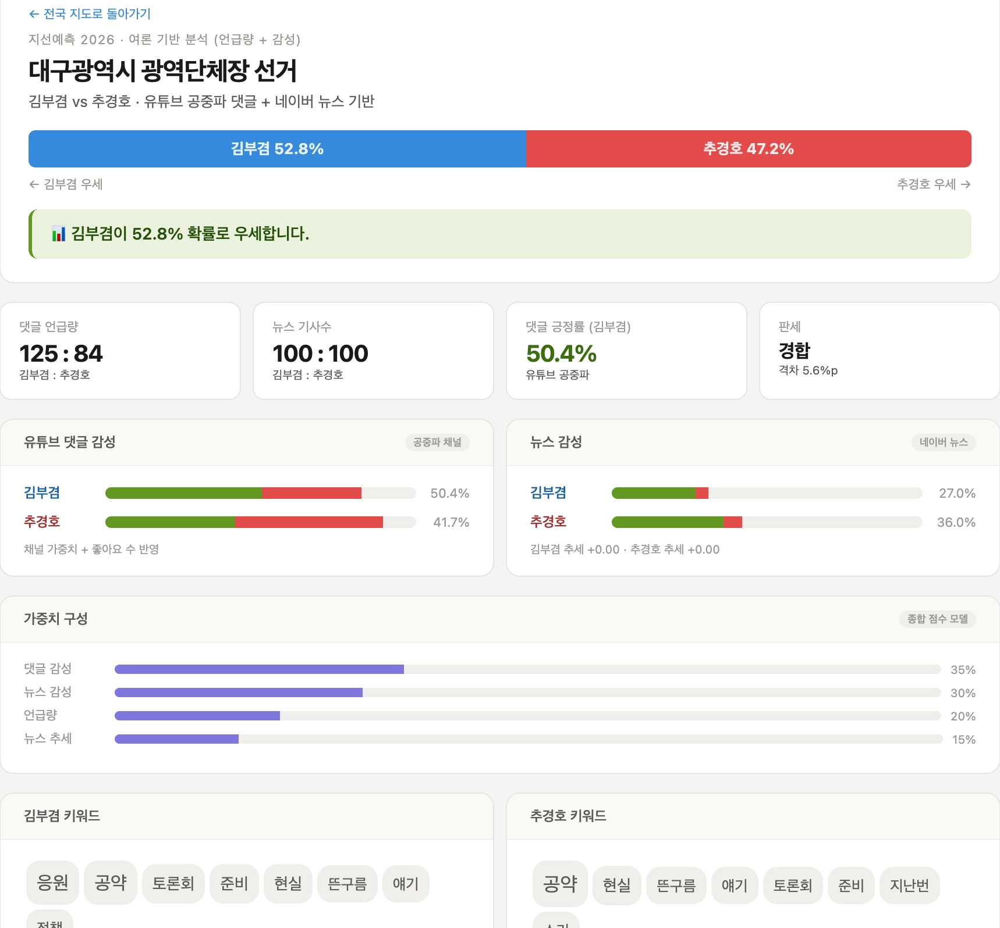

# 지선예측 2026 — 여론 기반 선거 판세 분석

> 2026 제9회 전국동시지방선거(6.3)를 앞두고 **유튜브 댓글과 뉴스 기사의 여론(언급량 + 부정/긍정 키워드)** 을 분석해 16개 광역단체장 선거 판세를 시각화하는 파이썬 프로젝트입니다.

#### 전국 판세 지도
<p align="center">
  
</p>

---

## 목차

- [왜 만들었나](#왜-만들었나)
- [처음 구상](#처음-구상과)
- [어떻게 동작하나](#어떻게-동작하나)
- [분석 알고리즘](#분석-알고리즘)
- [화면 구성](#화면-구성)
- [설치 및 실행](#설치-및-실행)
- [프로젝트 구조](#프로젝트-구조)
- [한계와 주의사항](#한계와-주의사항)

---

## 왜 만들었나

선거철이 되면 수많은 여론조사가 쏟아지지만 정작 **온라인 여론**이 어떻게 흐르는지를 한눈에 보여주는 도구는 드뭅니다. 여론조사는 표본을 추출해 묻는 방식이라면 댓글과 뉴스는 사람들이 **자발적으로 쏟아내는 날것의 반응**이라고 볼 수 있습니다. 

그래서 "여론조사 숫자 말고 실제 온라인 상에서 후보들이 어떻게 인식되는지를 데이터로 정리해보자"는 생각에서 출발했습니다. 유튜브 댓글과 뉴스 기사를 모아 후보별 **언급량**과 **긍정/부정 키워드** 를 비교하고 이를 지도 위에 색으로 표현하는 것이 목표입니다.

---

## 처음 구상

이 프로젝트는 처음 계획대로 흘러가지 않았습니다. 

### 1차 구상 — 여론조사 지지율을 이용한 프로그램

처음에는 **FiveThirtyEight 방식의 여론조사 집계 모델**을 만들려고 했습니다. 여러 조사기관의 지지율을 조사기관 신뢰도·표본 크기·최신성으로 가중 평균하는 방식인데 문제는 **데이터 수집 단계**에서 막혀버렸습니다.

- 중앙선거여론조사심의위원회(`nesdc.go.kr`)는 **공개 API를 제공하지 않습니다.** 여론조사 결과를 등록·열람만 할 수 있습니다.
- 크롤링을 시도했지만 사이트가 **봇 요청을 403 Forbidden으로 차단**했습니다. `requests`로는 뚫리지 않았고 Selenium 같은 브라우저 자동화가 필요했습니다.
- 공공데이터포털(`data.go.kr`)에는 민간 여론조사 데이터가 사실상 없었습니다.

여론조사 수치를 안정적으로 가져올 방법이 마땅치 않았기에 새로운 방법을 생각해 내야만 했습니다.

### 2차 구상 — 온라인 여론 기반 분석 

결국 **지지율 숫자 대신 온라인 텍스트를 분석**하기로 했습니다.

- **유튜브 댓글**: YouTube Data API v3로 수집 
- **네이버 뉴스**: 네이버 검색 API로 기사 제목·요약 수집 

### Bias를 줄이기 위한 설계

유튜브 댓글은 플랫폼과 채널에 따라 편차가 있고 특정 bias가 있을 가능성이 굉장히 큽니다. 그래서 두 가지 안전 장치를 넣었습니다.

1. **공중파/종편 채널만 화이트리스트로 수집** — 아무 채널이나 긁지 않고 KBS·MBC·SBS·JTBC 뉴스 채널의 영상 댓글만 모았습니다.
2. **채널별 가중치** — 채널 신뢰도에 따라 가중치를 다르게 줍니다.

---

## 어떻게 동작하나

전체 파이프라인은 **수집 → 분석 → 시각화** 3단계입니다.

```
[1. 수집]  유튜브 공중파 댓글 + 네이버 뉴스
                    ↓
[2. 분석]  형태소 분석 → KNU 감성사전 매칭 → 후보별 점수
                    ↓
[3. 시각화]  종합 우세 확률 계산 → HTML 리포트 + 전국 지도
```

각 단계는 독립된 모듈로 분리돼 있습니다.

| 모듈 | 역할 |
|------|------|
| `data/collector.py` | 유튜브·네이버 API 수집 (캐싱·재시도 포함) |
| `data/analyzer.py` | 긍/부정 분석 + 키워드 추출 + 우세도 계산 |
| `data/regions.py` | 16개 광역단체와 후보 명단 정의 |
| `main.py` | 한 지역 분석 → HTML 리포트 생성 |
| `build_all.py` | 전 지역 일괄 분석 → 전국 지도 생성 |

---

## 분석 알고리즘

### 1단계 — 긍/부정 분석 (KNU 감성사전 + 형태소 분석)

초기에는 직접 만든 단어 40여 개로 긍/부정을 판정했는데 정확도가 떨어졌었습니다. 그래서 한국어 감성사전을 이용했습니다.

**KNU 한국어 감성사전** (군산대, 14,854개 단어)
각 단어에 긍/부정에 따라 `-2 ~ +2`의 극성(polarity)이 매겨져 있습니다. 

**kiwipiepy 형태소 분석**
텍스트를 형태소로 쪼개 명사·동사·형용사만 골라 사전과 매칭합니다. 동사·형용사는 어간으로 쪼개지므로("좋겠다" → "좋") `다`를 붙여("좋" → "좋다") 사전과 매칭되도록 보정했습니다.

댓글의 점수 계산:

```
점수 = Σ(매칭된 단어의 극성)
점수 > 0 → 긍정 / 점수 < 0 → 부정 / 점수 = 0 → 중립
```

### 2단계 — 댓글 가중 집계

신뢰도 높은 채널의 댓글과 좋아요가 많은 댓글에 더 무게를 줍니다.

```
가중치 w = 채널_신뢰도 × log(좋아요 수 + 2)
가중 감성 점수 = Σ(긍정 댓글의 w) − Σ(부정 댓글의 w)
                ─────────────────────────────────
                          Σ(전체 w)
```

### 3단계 — 종합 우세 확률

네 가지 지표를 가중 합산해 두 후보의 최종 점수를 냅니다.

| 지표 | 가중치 | 설명 |
|------|:---:|------|
| 댓글 감성 | **35%** | 유튜브 공중파 댓글의 긍정도 |
| 뉴스 감성 | **30%** | 네이버 뉴스 기사의 긍정도 |
| 언급량 | **20%** | 얼마나 많이 회자되는가 (관심도) |
| 뉴스 추세 | **15%** | 최근 7일 긍정 비율의 변화 |

```python
최종점수 = 댓글감성 × 0.35 + 뉴스감성 × 0.30 + 언급량 × 0.20 + 추세 × 0.15
A_확률 = A_최종점수 / (A_최종점수 + B_최종점수) × 100
```

격차가 6%p 이내면 **경합**, 그 이상이면 **우세**로 판정합니다.

### 4단계 — 키워드 추출

형태소 분석으로 명사(NNG, NNP)만 추출하고, 후보 본인 이름과 "서울/시장" 같은 뻔한 단어는 불용어로 걸러 자주 등장한 단어를 보여줍니다.

---

## 화면 구성

### 전국 지도 (`index.html`)

통계청 행정구역 경계 데이터(TopoJSON)를 SVG path로 변환해 그렸습니다. 우세도에 따라 5단계 색상(진파랑 → 연파랑 → 주황 → 연빨강 → 진빨강)으로 칠하고 지역을 클릭하면 상세 분석으로 이동합니다다. 작은 광역시는 이름 라벨을 지도 밖으로 빼 지시선으로 연결했습니다.

### 지역별 상세 리포트 (`report_*.html`)

각 지역마다 종합 우세 확률, 댓글/뉴스 긍/부정 비교, 가중치 구성, 후보별 키워드를 보여줍니다.

#### 부산 상세 리포트
<p align="center">
  
</p>

#### 서울 상세 리포트
<p align="center">
  
</p>

#### 대구 상세 리포트
<p align="center">
  
</p>

---

## 설치 및 실행

### 1. 라이브러리 설치

```bash
pip install requests pandas python-dotenv kiwipiepy
```

### 2. API 키 설정

프로젝트 루트에 `.env` 파일을 만들고 키를 넣습니다. (`.env`는 `.gitignore`로 깃에 올라가지 않습니다.)

```
# 네이버 개발자센터 (developers.naver.com) — 검색 API
NAVER_CLIENT_ID=발급받은_ID
NAVER_CLIENT_SECRET=발급받은_SECRET

# 구글 클라우드 콘솔 — YouTube Data API v3
YOUTUBE_API_KEY=발급받은_키
```

> 키가 없어도 더미 데이터로 전체 파이프라인이 동작합니다. (단, 결과 수치는 무작위 생성된 가짜입니다.)

### 3. KNU 감성사전 다운로드

```bash
curl -sL "https://raw.githubusercontent.com/park1200656/KnuSentiLex/master/data/SentiWord_info.json" -o data/SentiWord_info.json
```

### 4. 실행

```bash
# 한 지역만 분석
python3 main.py --region 서울특별시

# 전국 16개 지역 일괄 분석 + 지도 생성
python3 build_all.py
```

`output/index.html`을 브라우저로 열면 전국 지도가 보입니다.

---

## 프로젝트 구조

```
KOREAN_ELECTION_2026/
├── main.py              # 한 지역 분석 → 리포트 생성
├── build_all.py         # 전 지역 일괄 빌드 + 전국 지도
├── data/
│   ├── collector.py     # API 수집 (캐싱·재시도)
│   ├── analyzer.py      # 긍/부정 분석·우세도 계산
│   ├── regions.py       # 지역·후보 설정
│   ├── kr_paths.json    # 지도 SVG path 데이터
│   └── SentiWord_info.json  # KNU 감성사전
├── output/              # 생성된 HTML (지도 + 지역별)
├── docs/images/         # README 이미지
├── .env                 # API 키 (깃 제외)
└── .gitignore
```

---

## 한계와 주의사항

**플랫폼 편향**
온라인 여론과 실제 표심 사이에는 큰 괴리가 있을 수 있습니다. 

**감성 분석의 한계**
단어 사전 방식은 **반어법과 부정어를 못 잡습니다.** "오세훈 참 잘한다"(비꼼)를 긍정으로, "뽑을 생각 없다"(부정어)를 긍정으로 오인할 수 있습니다. 정확도를 높이려면 한국어 딥러닝 모델이 필요합니다.

**API 할당량**
YouTube Data API는 검색 1회당 100유닛을 소비하고 무료 한도는 하루 10,000 유닛입니다. 전국 일괄 빌드 시 한도를 넘을 수 있어 **6시간 디스크 캐싱**과 **429 재시도(지수 백오프)** 를 넣었습니다. 그래도 첫 빌드는 채널 수를 줄여서(`collector.py`의 `NEWS_CHANNELS`) 테스트하는 것을 권합니다.

**가중치는 임의값**
종합 점수의 35/30/20/15 가중치는 검증된 값이 아니라 임의적으로 설정한 값입니다. 실제 선거 결과와 맞춰 보정한 적은 없습니다.

---

*본 프로젝트는 데이터 분석 학습 목적으로 제작되었으며 어떤 정치적 입장도 대변하지 않습니다.*
